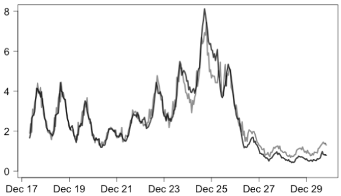
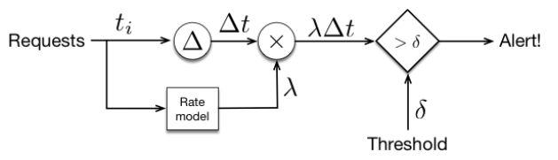
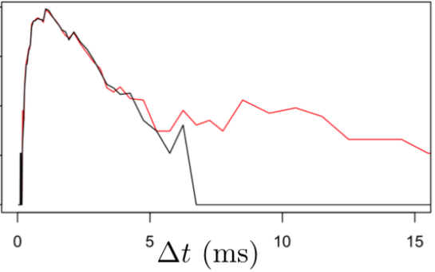
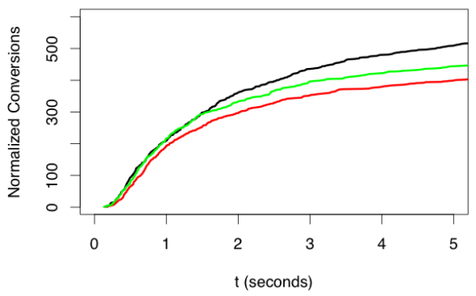

# Real-Life-Machine-Learning
Collection of repositories useful for real-life machine learning, including concepts such as monitoring and serving.

---

## Real Time Monitoring

### System Requests
>Monitor the arrival of requests. No model will give good results if you don't ask for them.

To monitor whether requests are arriving, you need to record the arrival of each incoming request, together with the identifier of the machine where the request has landed and an accurate timestamp.

* Record data to a persistent stream on a distributed platform because log files can disappear if a machine goes down.
* Record request arrival and completion as separate events to distinguish failure to respond from lack of requests.
The simplest monitor is measuring the time between requests. A better monitor is to build a simple predictor of the current request rate based on recent requests and use the predicted rate $\times$ time since the last request. You can use this to raise alerts if requests are not happening as expected.

### Response Time
>Measure the time it takes the system to respond to the request.

To measure the time it takes a system to respond we need to log the elapsed time as each request is responded to. These log entries should specify a unique ID for the original request, the current time, details of which model and hardware were used to compute the request as well as the elapsed time.

We can compute the distribution of the reported elapsed times. For latencies, we can use a non-uniform histogram.

Normal (expected) responses are plotted in black. Actual responses are plotted in red. The histogram shows that about 1% of responses are substantially delayed. Because of the log-scale on the vertical axis and the non-uniform bin sizes, the change in 99 percentile latency is clearly visible.

These histograms can also be compared using more advanced, automatic techniques, for example the G-test. Using the machine tags in the data, slow machines can be identified, allowing for specific targetting of diagnostic efforts.

### Model Results
>Are the model results correct?

Some models can give accurate results in short amounts of time. There are some models whose responses are not real-time, for example, product recommendations. In these models, the user can accept the offer instantly or in the next two months. You could measure the effectiveness of a set of models through time, and select a cutoff moment in which you decide the best model.

Remember that waiting for 95% of responses can take 10x longer than waiting for 50% of responses.

There are scenarios in which this approach is not viable - for example fraud detection, in which confirmation could take weeks or months, making errors in the model unaffordable.

### Distribution of Outputs
>What we're testing for is that the distribution of inputs is consistent with the inputs used to train the model - if you change the hypothesis space then the resulting model will not be optimal.

We assume that a consistent input distribution $X$ will produce a consistent output distribution $Y$ under the same model, such that if the distribution of $Y$ changes with respect to the expected one, we would assume the input distribution itself changed.

Therefore, we can detect these changes in the model by comparing the distribution of the output values with respect to a reference distribution (for example, the one used to train the model). To compare these distributions you could use G-tests or Kolmogorov-Smirnov statistic to detect these differences. Alternatively, you could use the t-digest system.

### Canary Models
>Another way to detect changes is to compare the current model to an older version, called a Canary model.

The idea is to send requests to both models, and compare the results. Since the canary is a model that does nearly the same thing that we want the current model to do, we can compare the output of two models to get a very specific idea about whether the new model is behaving as expected.

The average deviation between canary and current model shouldn't be too large - the aim should be small, incremental updates.
Can be used the quantify the risk of rolling out a new model to replace the current one. Measure the difference between new challenger and current model, as well as the difference between the challenger and the canary.
In particular, once we have models that are pretty good and we're making incremental improvements, no new challenger should differ dramatically from the current champion, nor from the canary. If there is a difference, then we stand a risk of lower accuracy, but also a chance for the challenger to shine. Focusing on these specific instances for manual inspection can often give us important insight into whether the challenger is ready to take on the champion.

### Serving Models (WIP)

---

### References
* https://www.kdnuggets.com/2019/01/monitor-machine-learning-real-time.html
* https://www.kdnuggets.com/2019/01/build-api-machine-learning-model-using-flask.html
* https://www.tensorflow.org/serving/
* https://js.tensorflow.org/
* https://www.tensorflow.org/lite/
